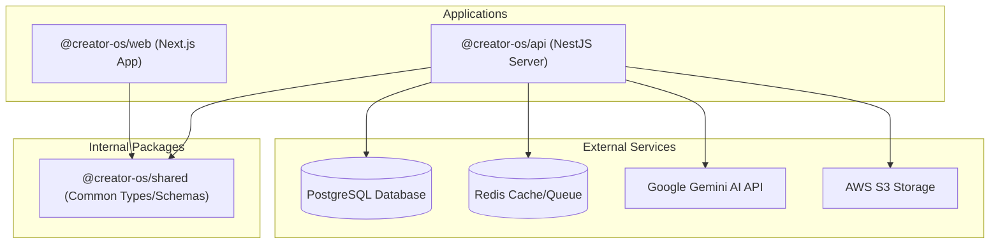

# CreatorOS — Dependency Graph

This document describes the package relationships and internal workspaces within CreatorOS.

---

## 1. Monorepo Dependency Flow

Below is a visualization of the dependency hierarchy within CreatorOS:

---

## 2. Workspace Dependencies

### `@creator-os/shared`

- **External Dependencies:**
  - `zod`: Schema validation.
- **Exported Formats:** CJS, ESM.

### `@creator-os/api`

- **Internal Workspace Dependencies:**
  - `@creator-os/shared` (workspace version)
- **Primary External Dependencies:**
  - `@nestjs/common`, `@nestjs/core`, `@nestjs/platform-express`: Core NestJS framework.
  - `@prisma/client`: Database ORM.
  - `bullmq` & `@nestjs/bullmq`: Task/Job queuing.
  - `ioredis`: Redis connector.
  - `bcryptjs`, `passport`, `passport-jwt`, `passport-local`: Authentication & Security.
  - `@google/generative-ai`: Gemini AI integration.
  - `@aws-sdk/client-s3`: S3 asset uploads.
  - `class-validator`, `class-transformer`: Input validation and DTO transformation.
  - `docx`, `mammoth`, `pdf-parse`: Document compilation and parsing.

### `@creator-os/web`

- **Internal Workspace Dependencies:**
  - `@creator-os/shared` (workspace version)
- **Primary External Dependencies:**
  - `next` (v14.2.5), `react`, `react-dom`: Framework UI.
  - `next-auth`: Client session management.
  - `lucide-react`: SVG icon library.
  - `framer-motion`: Web UI animations.
  - `recharts`: Dashboard visual stats.
  - `@hookform/resolvers`, `react-hook-form`: Client validation forms.
  - `clsx`, `tailwind-merge`: CSS layout utility styling.
  - `@dnd-kit/core`, `@dnd-kit/sortable`: Kanban Board drag & drop capabilities.
