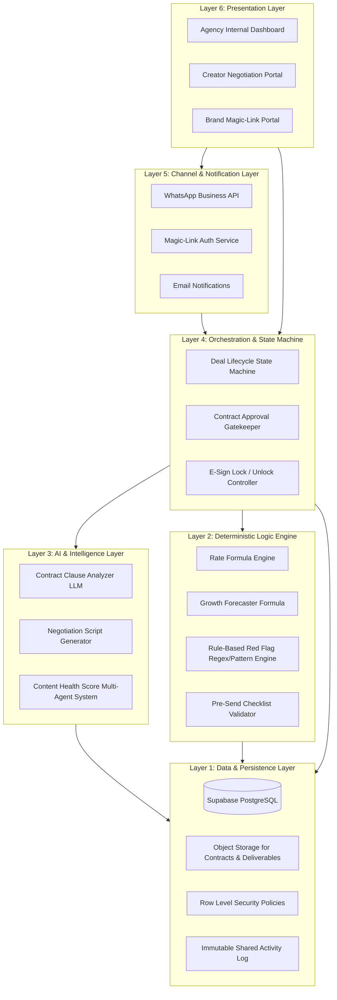

# CreatorOS — Architecture & System Design

This document details the multi-layered architecture, data schemas, role-based security model, and orchestration workflows powering CreatorOS.

---

## 🏛️ System Architecture Layers

CreatorOS is designed with strict separation of concerns across 6 distinct architectural layers:

---

## 1. Layer Breakdown

### Layer 1: Data Layer (Supabase / PostgreSQL)
- **Entities:** Creators, Brands, Deals, Contracts, Clauses, Deliverables, Invoices, Activity Log.
- **Security:** Row Level Security (RLS) ensuring creators only view their own deals, brands only access permitted tokenized portals, and agencies maintain overarching administrative visibility.
- **Auditability:** Immutable activity log entries generated for all state transitions (deal creation, rate generation, contract upload, red-flag detection, escalation resolution, e-sign, deliverable approval, payment confirmation).

### Layer 2: Deterministic Logic Layer
To ensure complete predictability and zero hallucination risk in financial and compliance calculations, Layer 2 is strictly deterministic (pure mathematical and rule-based functions):
- **Rate Range Calculator:**
  $$\text{Base Rate} = (\text{Weekly Views} \times \text{Niche CPM}) + \text{Follower Multiplier} + \text{Engagement Adjustment}$$
  $$\text{Ask Range} = [\text{Base Rate} \times 0.85, \, \text{Base Rate} \times 1.35]$$
- **Growth Forecaster:** Compounding weekly growth with confidence intervals:
  $$\text{Projected Reach}_t = \text{Reach}_0 \times (1 + g)^t$$
- **Pre-Send Checklist Gate:** Enforces mandatory parameters (Usage Rights Duration, Exclusivity Scope, Revision Limits, Payment Timeline) before counters can be dispatched.
- **Rule-Based Red-Flag Engine:** Regex and token pattern matching for high-risk clauses (e.g., perpetual rights, indemnity without caps, unpaid whitelisting).

### Layer 3: AI & Intelligence Layer
- **Clause Explanation:** Single-shot LLM pass summarizing complex legal legalese into plain English bullet points.
- **Negotiation Script Generator:** Dynamic generation of polite yet firm counter-offer scripts for common scenarios (lowball offers, scope creep, exposure-only requests).
- **Content Health Score (Phase 3 Multi-Agent Loop):**
  1. *Niche Insider Agent:* Evaluates cultural and technical relevance for target audience.
  2. *Cold Viewer Agent:* Evaluates hook retention, early drop-off risk, and standalone clarity.
  3. *Platform Pattern Agent:* Benchmarks pacing, cut frequency, and CTA placement against aggregated retention data.
  4. *Synthesis Orchestrator:* Synthesizes the 3 outputs into a single score, plain-language reason, and rewrite suggestion.

### Layer 4: Orchestration & Workflow Engine
- An event-triggered finite state machine managing deal transitions:
  `Intake` $\rightarrow$ `Scoring & Rate Calculation` $\rightarrow$ `Negotiation Draft` $\rightarrow$ `Checklist Gate Cleared` $\rightarrow$ `Contract Uploaded` $\rightarrow$ `Red-Flag Scan` $\rightarrow$ (`Compliance Escalation` OR `E-Sign Ready`) $\rightarrow$ `Signed` $\rightarrow$ `Deliverable Submitted` $\rightarrow$ `Brand Approved` $\rightarrow$ `Paid`.

### Layer 5: Channel Layer
- **WhatsApp Business API:** Instant alerts for urgent actions (contract red-flags, deal counters, payment receipts).
- **Magic-Link Authentication:** Secure passwordless access for brand representatives to review deliverables and sign off on milestone releases.

### Layer 6: Presentation Layer (React + TypeScript)
- **Role-Based Portals:**
  - **Agency Ops Portal:** Multi-creator deal pipeline, compliance queue, agency-wide revenue benchmarks.
  - **Creator Portal:** Deal negotiation tools, growth forecasts, contract status, deliverable upload.
  - **Brand Portal:** Streamlined zero-login interface for deliverable approvals and status tracking.

---

## 🔒 Role-Based Access Control Matrix

| Capability / Feature | Agency Admin | Creator | Brand (Magic-Link) |
|---|:---:|:---:|:---:|
| View All Agency Creators & Deals | ✅ Full | ❌ Restricted | ❌ Restricted |
| Create Deal & Calculate Rates | ✅ | ✅ | ❌ |
| Run Growth Forecaster & Negotiation Scripts | ✅ | ✅ | ❌ |
| Upload & Scan Contracts | ✅ | ✅ | ❌ |
| View Rule-Based Legal Red Flags | ✅ | ✅ | ❌ |
| Clear Compliance Escalations / Hard Gates | ✅ (Lead/Legal) | ❌ | ❌ |
| E-Sign Approved Contracts | ✅ | ✅ | ✅ |
| Submit Deliverable for Review | ✅ | ✅ | ❌ |
| Review & Approve / Request Revision | ✅ | ❌ | ✅ |
| View Shared Activity Log | ✅ (All events) | ✅ (Creator events) | ✅ (Brand-facing events) |
| Invoicing & GST Details | ✅ | ✅ (Own) | ✅ (Payable) |
