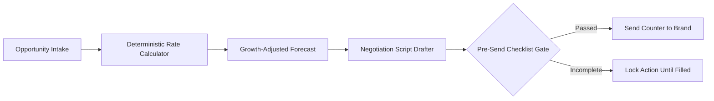
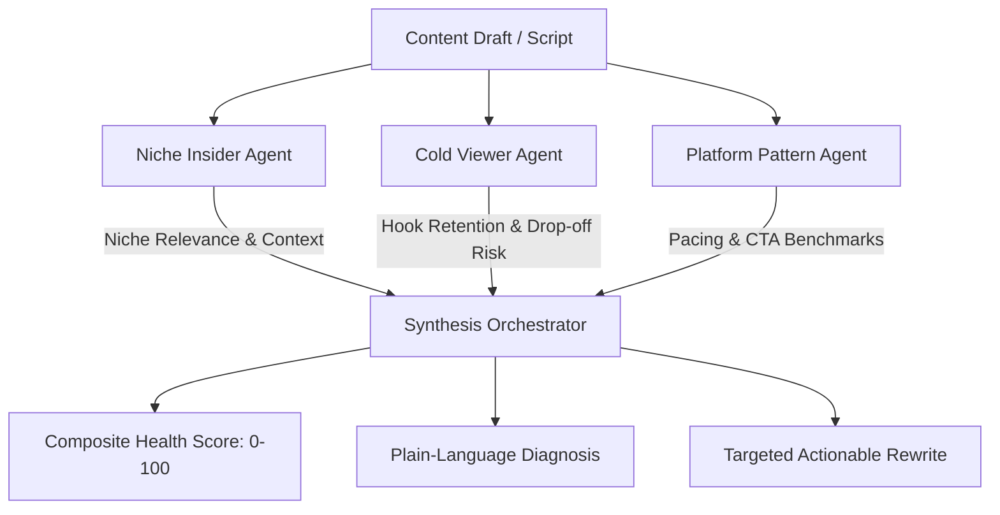

# CreatorOS — Feature Specifications & Modules

This document provides a detailed breakdown of all functional modules, calculation logic, and interaction flows in CreatorOS.

---

## 1. Agency Ops Core

The operational backbone connecting talent managers, creators, and corporate brand partners.

* **Creator Onboarding:** Profile creation, connected social accounts (YouTube, Instagram, TikTok, LinkedIn), niche tags, benchmark baselines.
* **Deliverable Pipeline:** Kanban & list views of active deliverables categorized by status (`Drafting`, `Internal Review`, `Brand Review`, `Approved`, `Live`).
* **Magic-Link Brand Portal:** Secure, token-based authentication links emailed or sent via WhatsApp to brand managers. Zero password friction for reviewing video drafts and granting approvals.
* **Shared Activity Log:** High-integrity audit trail recording all key actions with timestamps and author tags.

---

## 2. Creator Negotiation Dashboard

A data-driven negotiation toolkit that helps creators and managers price brand collaborations accurately and avoid predatory contract terms.

### Rate Calculator Formula
Calculates realistic base, floor, and ceiling pricing based on empirical audience metrics:
$$\text{Baseline} = (\text{Views per Week} \times \text{Niche CPM Factor}) + \text{Tier Multiplier} + \text{Engagement Modifier}$$
- **Conservative Floor (85%):** Minimum viable counter.
- **Target Ask (100%):** Standard fair-market proposal.
- **Optimistic Ceiling (135%):** High-leverage anchor.

### Pre-Send Checklist Gate
Prevents deals from moving forward until critical parameters are locked:
1. **Usage Rights Window:** Explicit duration (e.g., 30 days, 90 days, 1 year).
2. **Exclusivity Scope:** Specific competitors and category boundaries.
3. **Revision Allowance:** Strict cap on free revisions (standard: 2 rounds).
4. **Payment Terms:** Clear timeline (e.g., Net 15, Net 30, 50% upfront).

---

## 3. Legal & Contract Intelligence

An automated contract vetting engine that combines regex pattern matching with targeted LLM reasoning to identify toxic terms before signing.

* **Clause Breakdown:** Automatically segments legal agreements into functional clauses (Payment, IP Rights, Exclusivity, Indemnification, Revisions, Kill Fee).
* **Red-Flag Detection Engine:**
  - 🔴 **Perpetual IP Transfer / Full Buyout** without buyout surcharge.
  - 🔴 **Unpaid Whitelisting / Meta Ad Boosting Rights**.
  - 🔴 **Unlimited / Uncapped Revisions**.
  - 🔴 **Indefinite or Broad Non-Compete / Exclusivity**.
  - 🔴 **Unilateral Kill Clauses** with zero kill fee protection.
* **Compliance Escalation Hard Gate:** Contracts triggering red flags are locked from e-signature until an agency legal lead or compliance officer reviews and amends the terms.

---

## 4. Rate & Deal Benchmarking

Aggregates anonymized, real-world deal data across creator niches, follower tiers, and platform formats.

* **Niche Breakdown:** Tech, Finance, Beauty, Fitness, Gaming, Lifestyle, B2B SaaS.
* **Deliverable Formats:** Dedicated YouTube Video, Integrated 60s Segment, Instagram Reel, TikTok, Carousel, Story with Link.
* **Market Insights:** Median CPMs, average exclusivity premiums, and regional variance across tier-1 and tier-2 markets.

---

## 5. Content Health Score (Multi-Agent Pre-Publish Intelligence)

An AI evaluation pipeline that audits video drafts before they are sent to the brand or published publicly.

1. **Niche Insider Agent:** Assesses technical authenticity, inside references, and community resonance.
2. **Cold Viewer Agent:** Assesses first 3-second hook strength, standalone comprehensibility, and scroll-stopping power.
3. **Platform Pattern Agent:** Compares cut rate, pacing velocity, and CTA placement against top-performing retention curves.
4. **Synthesis Orchestrator:** Outputs a single unified score (0–100), diagnosis, and direct rewrite snippet.

---

## 6. India-First Operational Layer

Tailored for the Indian creator economy ecosystem:
* **WhatsApp Business Integration:** Interactive notification buttons for fast approvals, reminders, and invoice notifications.
* **GST & PAN Invoicing:** Automatic TDS deduction calculation (Section 194J/194C), GSTIN validation, and HSN/SAC code generation.
* **Multi-Currency & INR Settlement:** Transparent fee breakdowns in INR with automated payment reconciliation.
