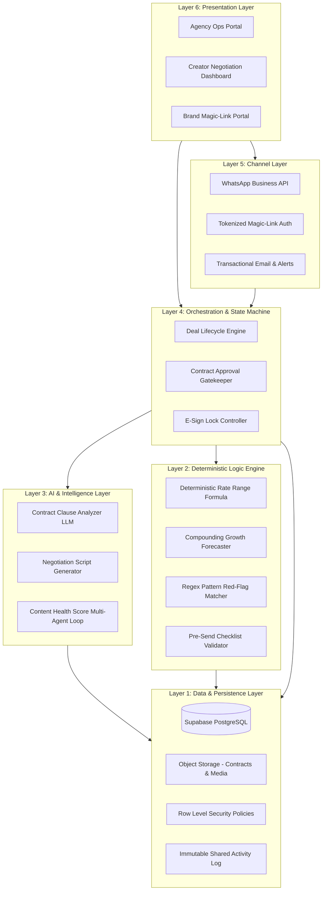
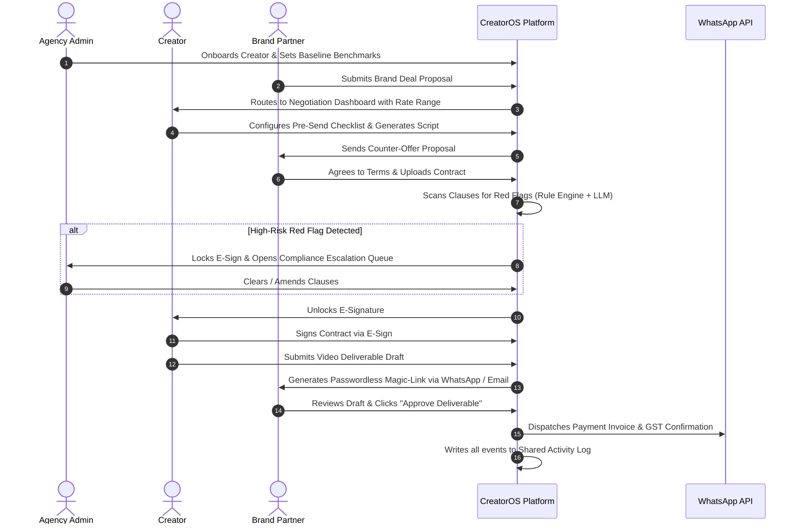

# CreatorOS — Project Page

> **An all-in-one operating system and negotiation intelligence platform designed for creator management agencies, digital talent, and brand partners.**

---

## 📌 Executive Summary & Problem Statement

The global creator economy is projected to exceed **$480 Billion by 2027**, yet creator agencies and independent talent still manage high-stakes brand deals through fragmented channels:
1. **Unscientific & Vulnerable Pricing:** Deal pricing is arbitrary, often leading to creators being underpaid or leaving significant leverage on the table.
2. **Predatory Contract Clauses:** Traditional contracts frequently conceal perpetual usage rights, unpaid whitelisting/boosting clauses, uncapped revisions, and unilateral termination clauses.
3. **Fragmented Operational Chaos:** Deal tracking, deliverable approvals, and payment statuses are scattered across WhatsApp chats, unversioned Google Sheets, and lost email threads.
4. **Lack of Auditable Truth:** Disputes frequently arise between agencies, creators, and brands regarding approval timestamps and revision counts.

**CreatorOS** solves these critical pain points by unifying:
- A **Deterministic Mathematical Pricing Engine** with compounding audience growth forecasting.
- An **AI-Powered Legal & Contract Intelligence Screener** with hard compliance escalation locks.
- A **Multi-Portal Operational Workspace** connecting Agency Admins, Creators, and Brand Partners over an immutable, shared activity log.

---

## 🏛️ System Architecture & Multi-Layer Design

CreatorOS is architected with a strict separation of concerns across 6 distinct functional tiers:

For complete architectural specifications, database schemas, and state machine transitions, read [docs/architecture.md](architecture.md).

---

## 🚀 Core Modules & Capabilities

| Module | Core Purpose | Key Features |
|---|---|---|
| **Agency Ops Core** | Unified roster & campaign management | Multi-creator pipeline, deliverable kanban, brand approval chain, shared activity log. |
| **Creator Negotiation Engine** | Algorithmic pricing & leverage | CPM formula engine, compounding growth confidence band, ready-to-send counter scripts, pre-send checklist gate. |
| **Legal & Contract Intelligence** | Toxic term screening & risk mitigation | Clause breakdown, red-flag detection (perpetual buyout, unpaid boosting, unlimited revisions), hard compliance lock. |
| **Rate & Deal Benchmarking** | Real-world empirical market data | Niche CPM rates, follower tier benchmarks, format-specific deal intelligence (Reels, Shorts, YouTube Dedicated). |
| **Content Health Score** | Pre-publish video audit & optimization | Multi-agent evaluation (Niche Insider, Cold Viewer, Platform Pattern Agent), composite score (0–100), actionable rewrite suggestions. |
| **India-First Layer** | Regional operational infrastructure | WhatsApp Business API alerts & approvals, GST/PAN-compliant INR invoicing, TDS withholding calculator. |

For exhaustive feature specifications, formulas, and prompt designs, read [docs/features.md](features.md).

---

## 🧮 Mathematical Formulations

### 1. Deterministic Rate Range Calculator
$$\text{Base Rate} = \left(\frac{\text{Weekly Views}}{1000} \times \text{Niche CPM}\right) + \text{Tier Baseline}$$
$$\text{Engagement Multiplier} = 1 + (\text{Engagement Rate} - 0.03) \times 5.0$$
$$\text{Target Ask} = \text{Base Rate} \times \text{Engagement Multiplier}$$
$$\text{Floor Rate} = \text{Target Ask} \times 0.85 \quad \mid \quad \text{Ceiling Rate} = \text{Target Ask} \times 1.35$$

### 2. Compounding Growth Forecaster
$$\text{Projected Reach}_t = \text{Reach}_0 \times (1 + g)^t \quad \pm \quad z \cdot \sigma_t$$
Where $g$ represents the compounding weekly growth velocity and $z \cdot \sigma_t$ establishes the confidence band.

---

## 👥 Role-Based Portals & User Workflows

---

## 💻 Tech Stack

- **Frontend:** React 18, TypeScript, Vite, Custom Design System, Lucide Icons
- **Backend / Database:** Supabase (PostgreSQL, Storage, Magic-Link Auth, Row Level Security)
- **Deterministic Math Engine:** Pure TypeScript execution layer (Zero AI Hallucination)
- **AI & Evaluation:** Multi-agent LLM reasoning pipeline (Claude 3.5 Sonnet / OpenAI GPT-4o)
- **Messaging & Notifications:** WhatsApp Business Cloud API & Webhooks
- **CI/CD & Documentation:** GitHub Actions + GitHub Pages

---

## 📓 Team Technical Journals

Each team member maintains an individual technical journal documenting weekly engineering contributions, architectural decisions, and problem-solving logs:

* **Journal Directory:** [`journals/`](../journals/)
* **Journal Guidelines & Standards:** [`journals/README.md`](../journals/README.md)
* **Weekly Submission Template:** [`journals/TEMPLATE.md`](../journals/TEMPLATE.md)

### Active Member Journal Links:
| Member Name | Role / Focus | Journal Path | Latest Status |
|---|---|---|:---:|
| **Mrityunjay Chaturvedi** | Lead / Architecture & Frontend | [`journals/mrityunjay/`](../journals/mrityunjay/) | [Week 02 (`week-02.md`)](../journals/mrityunjay/week-02.md) |

---

## 🌐 GitHub Pages Deployment Guide

This project is configured with automated CI/CD to deploy both the interactive web portal (`docs/index.html`) and markdown documentation (`docs/index.md`) to GitHub Pages.

To enable GitHub Pages:
1. Navigate to **Settings** > **Pages** in the GitHub repository.
2. Under **Build and deployment**:
   - **Source:** Select `Deploy from a branch` (or `GitHub Actions`).
   - **Branch:** Select `main` / Folder: `/docs`.
3. Click **Save**. The live portal will be available at:
   `https://<username>.github.io/<repository-name>/`

---

## 📂 Documentation Quick Links

- 📐 [docs/architecture.md — Detailed System Architecture](architecture.md)
- ⚡ [docs/features.md — Complete Feature Specifications](features.md)
- 💻 [docs/setup.md — Developer Setup & Installation](setup.md)
- 📝 [journals/README.md — Weekly Journal Guidelines](../journals/README.md)
